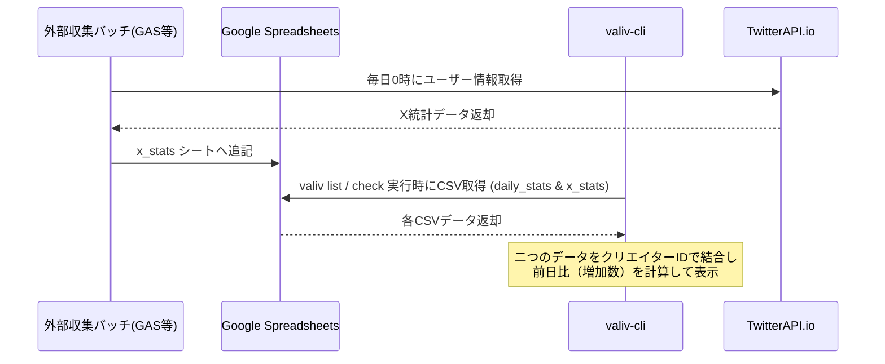

# TwitterAPI.io を活用した X (Twitter) 統計情報の可視化・推移機能の追加提案

本ドキュメントでは、サードパーティの X (Twitter) API 提供サービスである **TwitterAPI.io** を活用し、`valiv-cli` にてメンバーの X フォロワー数などの統計情報およびその増加数を可視化する機能の追加提案についてまとめます。

---

## 1. 提案の背景と目的

`valiv-cli` はアイドルマスター vα-liv (ヴイアラ) メンバーの活動情報を一元チェックするための CLI ツールです。すでに YouTube の登録者数や再生回数などの統計情報およびその前日比（増加数）を可視化する機能が実装されています。

本提案では、X (Twitter) に関してもリアルタイムな個別ポストの確認ではなく、**「フォロワー数の推移や活動量の変化」** などの統計データを可視化し、活動の成長を一覧で確認できるようにすることを目的とします。

---

## 2. 可視化対象の指標

`TwitterAPI.io` の `/twitter/user/info` エンドポイントから取得可能なプロフィール情報を基に、以下の項目およびその **前日比（増加数）** を可視化します。

| 項目 | 取得パラメータ | 可視化の意味・メリット |
| :--- | :--- | :--- |
| **フォロワー数** | `followers_count` | メンバーの人気・影響力の拡大傾向を把握する最も基本的な指標。 |
| **総ポスト数** | `tweet_count` | メンバーが X でどれだけ活発に告知や実況発信を行っているかの指標（活動頻度）。 |
| **リスト数** | `listed_count` | 一般ユーザーが作成した公開リストにメンバーが登録されている数。熱心なファン層の広がりを示す指標。 |
| **フォロー数** | `following_count` | 基本プロフィール項目として現在値のみを表示。 |

---

## 3. 実現方法：Google スプレッドシート（別シート x_stats）連携

YouTube の統計情報とは干渉しないように、スプレッドシート内に新しく **`x_stats`** シートを作成し、そこで履歴データを管理します。



*   **実装内容**:
    1.  スプレッドシートに **`x_stats`** シートを新規追加。
    2.  Google Apps Script (GAS) 等の定期バッチ側で `TwitterAPI.io` からデータを取得し、`x_stats` シートに毎日追記する。
    3.  `valiv-cli` は、`daily_stats`（YouTube用）に加えて `x_stats`（X用）からCSVデータを取得。
    4.  取得したデータを結合し、それぞれの統計情報と増加数（Growth）を計算。
*   **メリット**:
    *   **責務の分離**: YouTube 統計用の `daily_stats` と、X 統計用の `x_stats` が別シートになることで、データ構造の独立性が保たれ、今後のメンテナンスやスキーマ拡張が容易になります。
    *   **高いパフォーマンス**: CLI起動時の通信はスプレッドシートからのCSV取得（2枚分）のみで完了するため高速。
    *   **完璧な履歴**: ユーザーが毎日CLIを起動しなくても、スプレッドシート側で毎日自動記録されるため推移データが欠損しない。
    *   **ユーザー設定の簡素化**: 各ユーザーが `TwitterAPI.io` の API キーを取得・設定する必要がなく、バッチサーバー側のみでキーを管理できる。

---

## 4. 設計およびコード修正方針

### 4.1. ドメイン層 (Domain Layer)
`src/domain/models.ts` の `CreatorStatistics` インターフェースを拡張し、X 関連の統計データフィールドを追加します。

```typescript
export interface CreatorStatistics {
  // YouTube 統計 (既存)
  subscriberCount: string;
  viewCount: string;
  videoCount: string;
  subscriberGrowth?: number;
  viewGrowth?: number;
  videoGrowth?: number;

  // X (Twitter) 統計 (新規追加)
  xFollowersCount?: string;
  xTweetCount?: string;
  xListedCount?: string;
  xFollowersGrowth?: number;
  xTweetsGrowth?: number;
  xListedGrowth?: number;
  xFollowingCount?: string; // 現在値のみでOK
}
```

### 4.2. インフラストラクチャ層 (Infrastructure Layer)
`src/infrastructure/spreadsheet-service.ts` を修正し、`daily_stats` に加えて `x_stats` シートからデータを取得・マージする処理を実装します。

*   **`x_stats` シートのCSVフォーマット**:
    `Date, Member ID, Name, Followers, Tweets, Listed, Following`
*   **処理の流れ**:
    1.  `daily_stats` を取得・パースする。
    2.  `x_stats` を取得・パースする。
    3.  双方のデータを `Creator` の `id` で結合し、`CreatorStatistics` をマージして返却する。

### 4.3. プレゼンテーション層 (Presentation Layer)
`src/ui/screens/CreatorList.tsx` を拡張し、X のフォロワー数およびその増加数を YouTube の登録者数と並べて、または切り替えてテーブル表示できるようにレイアウトを修正します。
